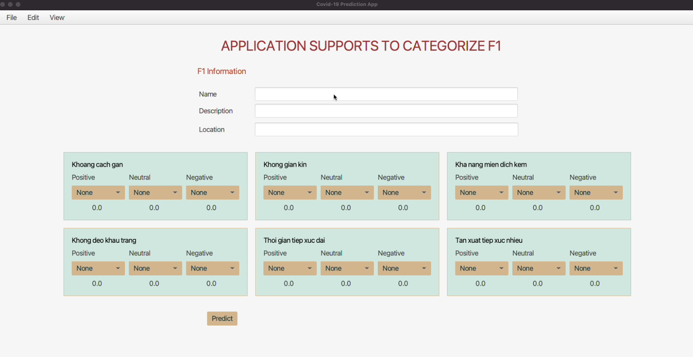
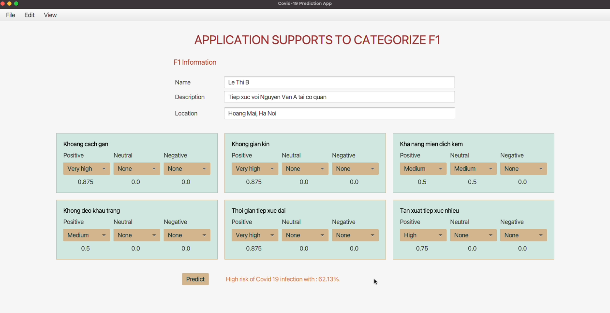
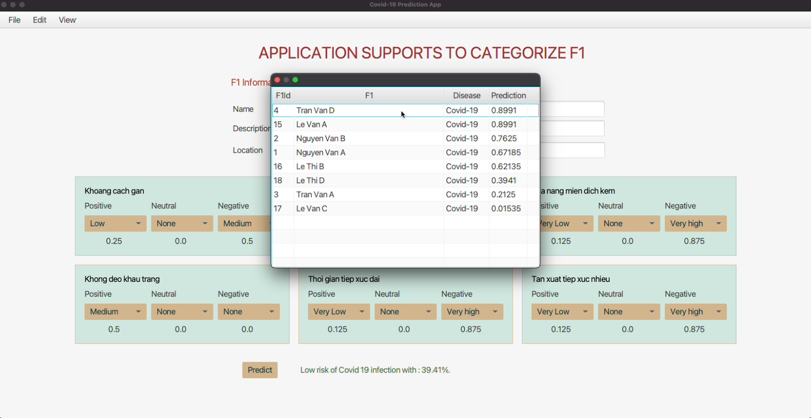

# PredictF1Application

Ứng dụng dự đoán tỉ lệ nhiễm covid của F1 dựa trên các yếu tố dịch tễ tiếp xúc với F0

---

##Công nghệ sử dụng:
1. JavaFx: tạo GUI
2. FuzzyLogic, Đại số gia tử, Java: logic tính xác suất
3. MySQL, JDBC, XAMPP: Lưu trữ và truy xuất dữ liệu

---

##Chức năng chính:
1. Nhập thông tin và dự đoán:
   
   
   
2. Sắp xếp thông tin các F1 theo tỉ lệ nhiễm giảm dần:
   